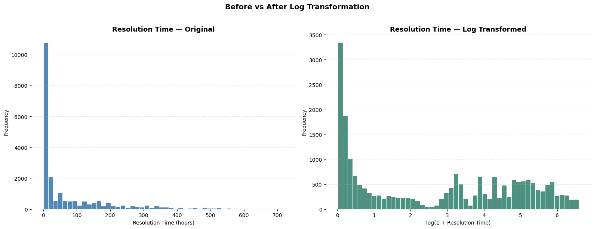
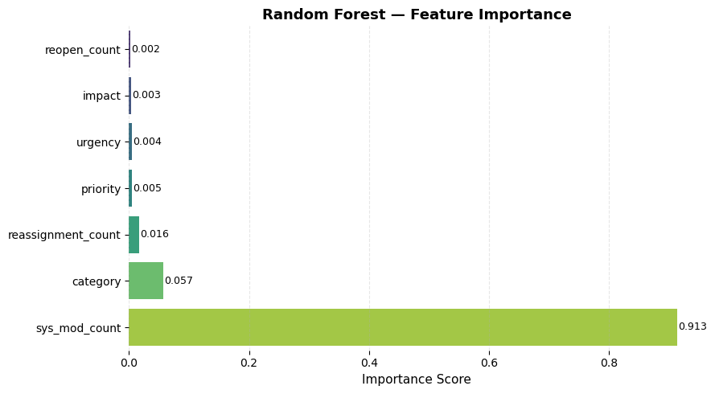
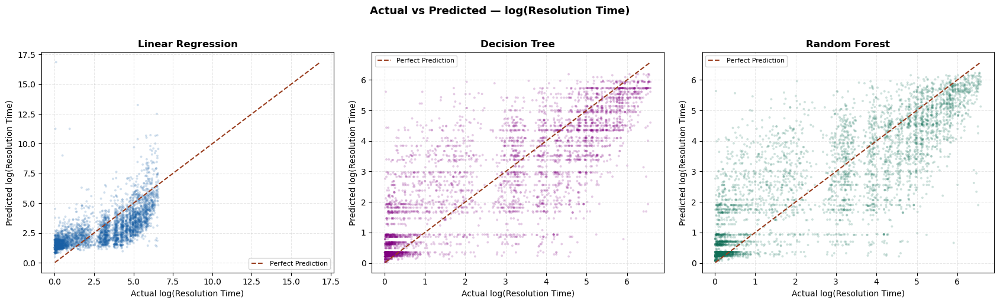

# IT Incident Resolution Time Prediction

An end-to-end data analytics and machine learning project that analyses IT service incident data and predicts how long an incident is likely to take to resolve.

The project covers the complete workflow from raw data exploration and preparation through exploratory data analysis, feature engineering, machine learning model comparison, evaluation, and deployment through an interactive Gradio interface.

## Project Objective

IT support teams handle large numbers of incidents with different priorities, categories and levels of complexity.

The objective of this project was to investigate the factors associated with incident resolution time and develop a machine learning model capable of predicting how long an IT incident may take to resolve.

The final solution can help support operational activities such as:

- SLA monitoring
- workload planning
- identification of potentially long-running incidents
- IT service desk decision-making

## Dataset

The original IT incident event log contains:

- **141,712 records**
- **36 attributes**

The dataset contains multiple event records for individual incidents, including information such as incident state, priority, impact, urgency, category, reassignment count, reopen count, system modification count and timestamps.

After data preparation and aggregation, the final modelling dataset contained:

- **22,168 unique incidents**
- **7 predictor variables**
- **1 target variable**

## Data Preparation

The raw dataset required several preparation steps before modelling.

Key tasks included:

- Inspecting data types, distributions and missing values
- Removing columns with excessive missing data
- Converting incident timestamps from text to datetime values
- Calculating incident resolution time
- Removing records without a valid target value
- Consolidating multiple event records into one final record per incident
- Investigating the distribution of resolution time
- Applying a `log1p` transformation to reduce heavy right skew
- Encoding categorical variables using `LabelEncoder`
- Selecting relevant features for modelling

The final target variable was:

`resolution_time_log`

This represents the log-transformed incident resolution time.

Resolution time was heavily right-skewed — most incidents closed within hours, a long
tail ran to several hundred. The `log1p` transformation was applied to give the models
a target they could fit:



## Features Used

Seven features were selected for the prediction models:

| Feature | Description |
|---|---|
| `priority` | Priority level of the incident |
| `impact` | Level of impact |
| `urgency` | Urgency of the incident |
| `category` | Anonymised incident category |
| `reassignment_count` | Number of times the incident was reassigned |
| `reopen_count` | Number of times the incident was reopened |
| `sys_mod_count` | Number of system modifications recorded |

## Exploratory Data Analysis

Exploratory analysis was carried out using Pandas, Matplotlib and Seaborn.

The analysis examined areas including:

- Incident state distribution
- Incident categories
- Priority, impact and urgency
- Reassignment behaviour
- Reopened incidents
- Resolution-time distribution
- Relationships between incident attributes and resolution time
- Correlation between final modelling features

One notable pattern was the relationship between reassignment and resolution time.

Incidents with no reassignments had a median resolution time of approximately **20 hours**, while incidents reassigned 10 times had a median resolution time of approximately **450 hours**.

On its own this made reassignment count look like an important predictor of resolution time. The feature importance analysis later showed otherwise, and the reason is covered under Model Evaluation below.

## Machine Learning

Three regression models were trained and compared:

1. Linear Regression
2. Decision Tree Regressor
3. Random Forest Regressor

The data was divided using an **80/20 train-test split**, producing:

- Training records: **17,734**
- Test records: **4,434**

Five-fold cross-validation was also used to evaluate model consistency across different subsets of the data.

### Model Performance

| Model | Test R² | CV Mean R² | MAE | RMSE |
|---|---:|---:|---:|---:|
| Linear Regression | 0.5107 | 0.5130 | 1.3005 | 1.5228 |
| Decision Tree | 0.6892 | 0.7018 | 0.8852 | 1.2137 |
| **Random Forest** | **0.6944** | **0.7094** | **0.8759** | **1.2035** |

The **Random Forest Regressor** achieved the strongest overall performance and was selected as the final model.

Its predictions explained approximately **69.4% of the variance** in the unseen test data.

After converting predictions from log values back into hours, the Random Forest produced an average absolute prediction error of approximately **48.38 hours**.

## Model Evaluation

The models were evaluated using:

- Mean Absolute Error (MAE)
- Root Mean Squared Error (RMSE)
- R²
- Five-fold cross-validation
- Actual vs predicted analysis
- Residual analysis
- Feature importance

Feature importance analysis showed that the Random Forest relied overwhelmingly on a single feature:

| Feature | Importance |
|---|---:|
| `sys_mod_count` | **0.913** |
| `category` | 0.057 |
| `reassignment_count` | 0.016 |
| `priority` | 0.005 |
| `urgency` | 0.004 |
| `impact` | 0.003 |
| `reopen_count` | 0.002 |



This contradicted what the exploratory analysis had suggested. Reassignment count showed a strong relationship with resolution time on its own — a median of roughly 20 hours at zero reassignments against roughly 450 hours at ten — yet it accounts for only **1.6%** of the model's predictive weight, ranking below `category`.

The explanation is that the two variables measure overlapping behaviour. An incident that is reassigned repeatedly is also modified repeatedly, so `sys_mod_count` already carries most of the information `reassignment_count` would have contributed. Once the stronger of two correlated predictors is in the model, the weaker one has little left to explain.

The practical finding is therefore narrower than the exploratory charts implied: **how much a ticket is worked** predicts how long it takes, and system modification count is the better measure of that. A strong bivariate relationship is not the same thing as a strong predictor.

The results also showed that the Decision Tree and Random Forest models substantially outperformed Linear Regression, indicating that the relationship between incident characteristics and resolution time is not purely linear.



The spread is visible in all three panels. Linear Regression compresses its predictions
toward the middle and cannot reach the long tail at all; the tree-based models track the
diagonal far more closely but still scatter widely at short resolution times, where a
large proportion of the incidents sit.

## Limitations

The dominant feature is a finding and a problem at the same time.

`sys_mod_count` and `reassignment_count` are only known once an incident has been worked.
Neither exists at the moment a ticket is raised. A model drawing 91% of its weight from
`sys_mod_count` therefore cannot predict resolution time at intake — which is exactly when
a service desk would most want the estimate.

What it can do is estimate the remaining time for an incident already in progress, revising
the figure as the ticket is modified. That is a narrower claim than "predicts resolution
time", and it is the accurate one.

Predicting at intake would mean restricting the feature set to what is known at creation —
priority, impact, urgency, category, contact type, and the text of the report itself — and
accepting a substantially lower R². Comparing the two is the natural next step for this
project.

## Model Deployment

The selected Random Forest model and categorical encoders were saved using `joblib`.

Saved components include:

```text
rf_incident_model.pkl
label_encoders.pkl
```

A prediction function was then developed to accept raw incident information, apply the required encodings, generate a prediction and convert the result back into hours.

## Interactive Gradio Dashboard

A Gradio interface was created to make the prediction model accessible without requiring users to interact directly with Python code.

The dashboard accepts seven incident attributes and returns:

- Predicted resolution time in hours
- Low / Medium / High resolution-time risk indicator
- Estimated resolution date and time
- Explanation of the main risk factor associated with the prediction

This demonstrates how the machine learning model could be presented as a practical tool for IT service desk staff.

## Technologies Used

**Programming & Analysis**
- Python
- Jupyter Notebook

**Data Analysis & Visualisation**
- Pandas
- NumPy
- Matplotlib
- Seaborn

**Machine Learning**
- Scikit-learn
- Linear Regression
- Decision Tree Regression
- Random Forest Regression
- Label Encoding
- K-Fold Cross-Validation

**Model Persistence & Deployment**
- Joblib
- Gradio

## Project Workflow

```text
Raw IT Incident Dataset
        ↓
Data Understanding
        ↓
Data Cleaning & Preparation
        ↓
Exploratory Data Analysis
        ↓
Feature Selection & Encoding
        ↓
Train/Test Split
        ↓
Machine Learning
        ↓
Model Comparison
        ↓
Cross-Validation & Evaluation
        ↓
Random Forest Selection
        ↓
Model Persistence
        ↓
Gradio Prediction Interface
```

## Key Outcomes

The project demonstrates an end-to-end data science workflow combining data preparation, exploratory analysis, visualisation, machine learning and model deployment.

The Random Forest model achieved the best overall predictive performance, with a **test R² of 0.6944** and **5-fold cross-validation mean R² of 0.7094**.

Analysis showed that how much a ticket is worked predicts its resolution time far better than the priority, impact or urgency it was logged with, with system modification count carrying 91% of the model's predictive weight.

## Repository Contents

```text
IT-Incident-Data-Analysis/
│
├── data/
│   └── incident_event_log.csv
│
├── images/
├── IT_Incident_Resolution_Prediction.ipynb
├── label_encoders.pkl
├── rf_incident_model.pkl
└── README.md
```

## Author

**Hussnain Yaqoob**

BSc (Hons) Computing & IT Graduate

LinkedIn: www.linkedin.com/in/hussnain-yaqoob
